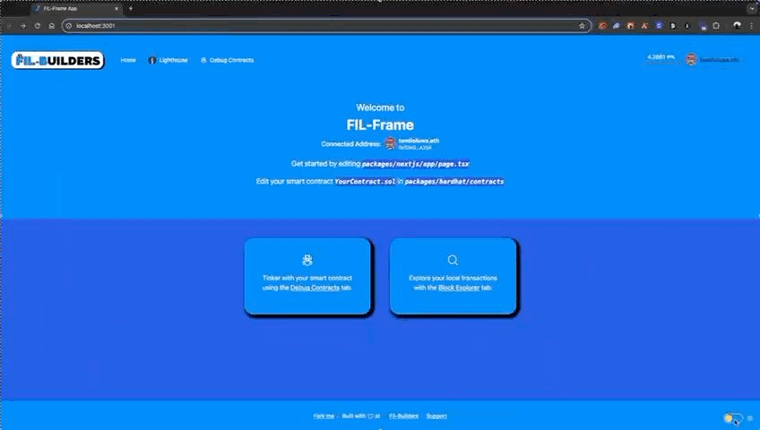

# FIL-Frame


*Fil-Frame setup in action.*

Welcome to FIL-Frame, a starter repository designed to help developers quickly get started with building decentralized applications (dApps) on the Filecoin network. This repository provides various integration options, including an example template using Lighthouse.

## Table of Contents

- [FIL-Frame](#fil-frame)
  - [Table of Contents](#table-of-contents)
  - [Overview](#overview)
  - [Unique Features](#unique-features)
  - [Getting Started](#getting-started)
    - [Prerequisites](#prerequisites)
    - [Installation](#installation)
    - [From source code](#from-source-code)
    - [Configuration](#configuration)
  - [Using the CLI](#using-the-cli)
      - [Interactive Mode](#interactive-mode)
      - [Flag Mode](#flag-mode)
      - [Storage Onramp Options](#storage-onramp-options)
    - [Configuration](#configuration-1)
  - [Usage](#usage)
    - [Deploying Smart Contracts](#deploying-smart-contracts)
    - [Running the Frontend](#running-the-frontend)
  - [Storage Onramp Options](#storage-onramp-options-1)
    - [Lighthouse](#lighthouse)
    - [Storacha](#storacha)
  - [Project Structure](#project-structure)
  - [Contributing](#contributing)
  - [License](#license)

## Overview

FIL-Frame is a monorepo that includes two main packages:

`hardhat`: Manages the blockchain-related aspects, including smart contract development, deployment, and testing.

`nextjs`: Handles the frontend and API aspects of the project using Next.js.

This repository is designed to be a quickstart for developers new to the Filecoin ecosystem, providing various integration options to suit different needs.

## Unique Features

FIL-Frame unlocks several unique features that make it an ideal starting point for developers looking to build decentralized applications (dApps) on the Filecoin network:

- On-Chain File Storage Deals: FIL-Frame enables developers to create and manage file storage deals directly on the blockchain (FVM) via smart contracts. This ensures transparency, security, and immutability for storage transactions.

- Seamless Integration with FVM: The repository provides built-in support for Filecoin's EVM compatible network, allowing developers to easily interact with the Filecoin network and leverage its decentralized storage capabilities, using tooling they're already familiar with.

- Multiple Storage Onramp Options: FIL-Frame offers various storage onramp options, including Lighthouse, Storacha and Akave, giving developers the flexibility to choose the solution that best fits their needs.

- Comprehensive Smart Contract Management: With Hardhat integration, developers can efficiently develop, deploy, and test smart contracts, easing the workflow for developers.

- User-Friendly Frontend: The Next.js frontend provides a modern and responsive interface for interacting with the blockchain, making it easier for users to engage with the dApp.

These features make FIL-Frame a powerful and versatile tool for developers entering the Filecoin ecosystem, providing all the necessary components to build robust and scalable decentralized applications.


## Getting Started

### Prerequisites

Ensure you have the following installed:

- [Node.js](https://nodejs.org/en/download/package-manager)
- [Yarn](https://yarnpkg.com/getting-started/install)
- [Hardhat](https://hardhat.org/hardhat-runner/docs/getting-started#installation)
- [Foundry](https://getfoundry.sh/)

### Installation

### From source code

### From source code

1. Clone the repository

```bash
git clone https://github.com/FIL-Builders/fil-frame
cd fil-frame 
```

2. (Optional) Switch to a different starter kit branch
Available branches include:

`lighthouse-nfts`: Integration with Lighthouse for decentralized storage.
`storacha-nfts`: Integration with Storacha for decentralized storage.
`akave-integration`: Integration with Akave for decentralized storage.

3. Install dependencies

```bash
yarn install
```

or

```bash
npm install
```

### Configuration

1. Copy the sample environment files, and fill in the required values:

```bash
cp packages/hardhat/.env.example packages/hardhat/.env
cp packages/nextjs/.env.example packages/nextjs/.env.local
```

2. Update the environment variables in the `.env` files with your own values.

## Using the CLI

The `create-filecoin-app` CLI tool helps you quickly set up a Filecoin-ready repository. It offers two modes: interactive mode and flag mode.

#### Interactive Mode

To use the interactive mode, simply run:

```bash
npx create-filecoin-app
```

You will be prompted to answer a series of questions to configure your new project. This includes your project name, and selecting your preferred storage onramp option (Lighthouse, or Storacha).

#### Flag Mode

If you prefer to skip the prompts, you can use the flag mode to specify your options directly. For example, to initialise a project named `my-app`, with lighthouse as the storage onramp:

```bash
npx create-filecoin-app my-app --lighthouse
```

This command initializes a new repository named `my-app` with Lighthouse as the storage onramp.

The flags available currently include:

- `--lighthouse`: this initializes a project using lighthouse as the storage onramp
- `--storacha`: this initializes a project using storacha as the storage onramp

#### Storage Onramp Options

- **Lighthouse**: Decentralized storage solution for NFTs and other data.
- **Storacha**: Another decentralized storage option, formerly known as web3.storage.

After running the CLI, your new project will be set up and ready for development with your chosen storage onramp.

### Configuration

1. Copy the sample environment files, and fill in the required values:

```bash
cp packages/hardhat/.env.example packages/hardhat/.env
cp packages/nextjs/.env.example packages/nextjs/.env.local
```

2. Update the environment variables in the `.env` files with your own values. (Note that the `NEXT_PUBLIC_ALCHEMY_API_KEY` value is optional)

## Usage

### Deploying Smart Contracts

To compile and deploy the smart contracts:

```bash
yarn compile
yarn deploy
```

or

```bash
npm compile
npm deploy
```

### Running the Frontend

To start the Next.js frontend:

```bash
yarn dev
```

or

```bash
npm run dev
```

The application will be available at
[`https://localhost:3000`](https://localhost:3000)


*Fil-Frame, with the Lighthouse integration.*

## Storage Onramp Options

### Lighthouse

The repository includes a template which makes use of Lighthouse for decentralized storage, and is available in the `lighthouse-nfts` branch.

To use this integration:

1. Ensure you have the Lighthouse API key set in your `.env.local` file:
`LIGHTHOUSE_API_KEY=your_lighthouse_api_key`
2. Run the following command:
`yarn dev` or `npm run dev`
3. Use the provided integration to upload files to Lighthouse

### Storacha
*Coming soon.*

## Project Structure

```
my-app/
├── packages/
│   ├── hardhat/
│   │   │── contracts
│   │   │── deploy
│   │   │── scripts
│   │   │── .env.example
│   │   │── README.md
│   │   │── package.json
│   │   └── ...
│   └── nextjs/
│       │── app
│       │── components
│       │── contracts
│       │── hooks/fil-frame
│       │── utils/fil-frame
│       │── .env.example
│       │── package.json
│       └── ...
│   
├── LICENSE
├── package.json
├── README.md
└── ...
```

## Contributing

We welcome contributions!

## License

This project is licensed under the MIT license. See the [LICENSE](./LICENSE) file for details.
